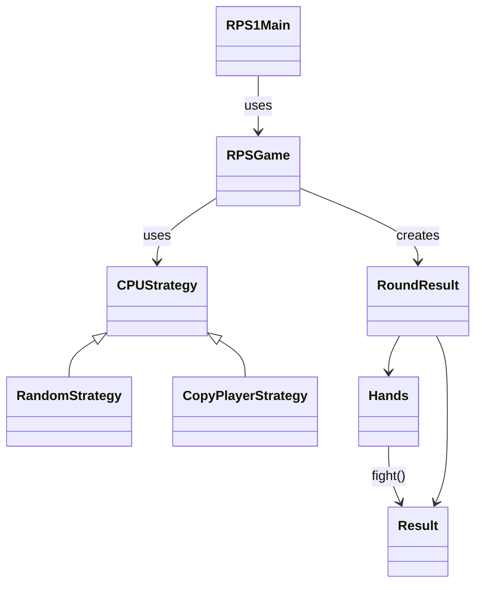
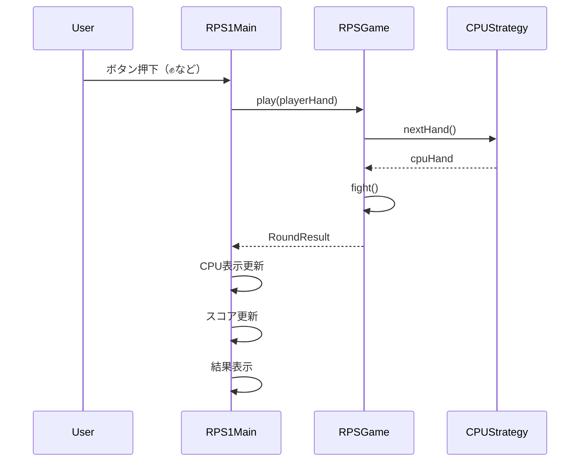

# RPS1Go

Swingで開発したじゃんけんゲームです。  
Javaのアプリケーション開発の基礎を学ぶことを目的とし、以下を意識して実装しています。  

- StrategyパターンによるCPU戦略の切り替え
- enumによるドメインモデルの表現（Hands / Result）
- UIとゲームロジックの分離
- シンプルな状態管理（スコア・対戦結果）

---

## ■ 主な機能

- じゃんけん対戦（グー / チョキ / パー）
- CPUとの対戦
- CPU戦略の切り替え
  - Random（ランダム）
  - Copy（プレイヤーの前回の手をコピー）
- スコア表示（プレイヤー vs CPU）
- 対戦結果表示（WIN / LOSE / DRAW）

---

## ■ パッケージ構成

```text
RPS1Main                    // メイン画面（Swing UI）

game
├─ RPSGame                  // ゲーム進行管理
├─ Hands                    // 手（グー・チョキ・パー）
├─ Result                   // 勝敗（WIN / LOSE / DRAW）
└─ RoundResult              // 1回の対戦結果

strategy
├─ CPUStrategy              // CPU戦略インターフェース
├─ RandomStrategy           // ランダム戦略
└─ CopyPlayerStrategy       // プレイヤーの手をコピーする戦略
```

---

## ■ クラス図



---

## ■ シーケンス図（1回の対戦）



---

## ■ 今後の改善

- プレイヤーの手の表示追加
- CPUの手のアニメーション
- スコアリセット機能
- Strategyの追加（勝ちに行くAI、学習型AIなど）

---

## ■ 学習ポイント

- Strategyパターン
- enum設計（状態と振る舞いの統合）
- 責務分離（UI / Game / Strategy）
- SwingによるGUI開発
